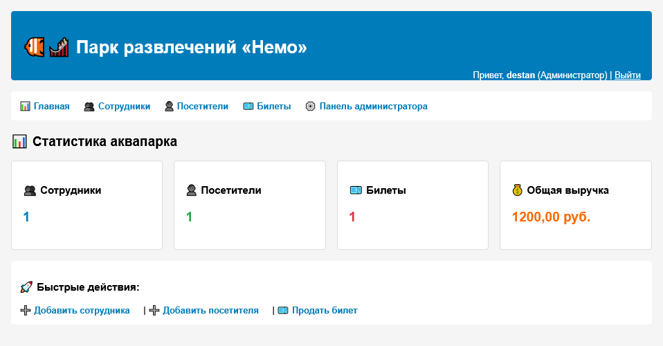

# Парк аттракционов "Немо"



Информационная система аквапарка на python django. Помогает управлению парком аттракционов.

## Возможности системы

* Бронирование билетов
* Работа с данными сотрудников и поситителей
* Сбор статистики по продаже билетов

## Запуск

Для запуска проекта скачайте его код и выполните следующие команды:

```shell
python manage.py migrate
python create_test_data.py
python manage.py runserver
```

## Используемые технологии

* HTML5, CSS3, JS
* Python 3.12+
* Django 5.2
* SQLite
